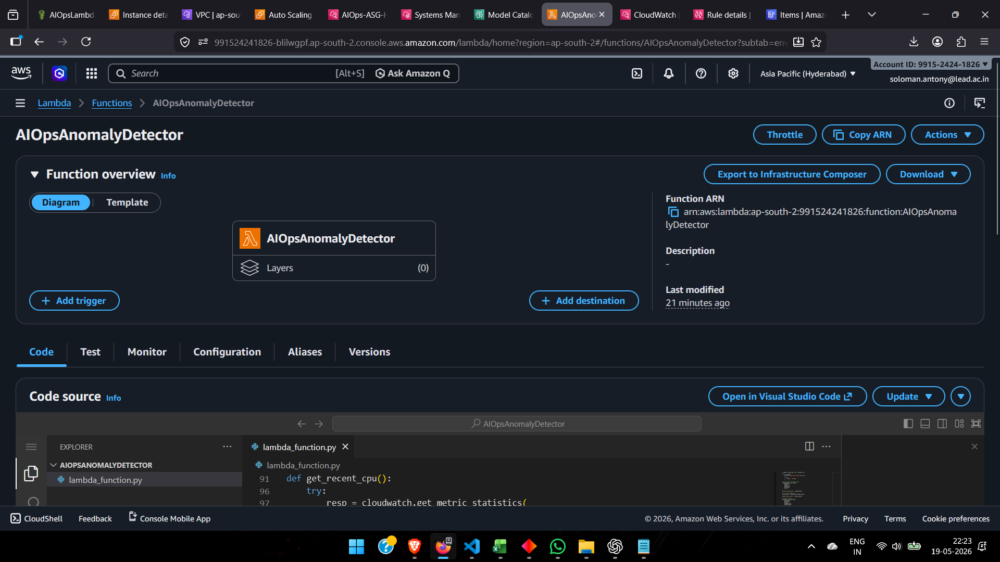
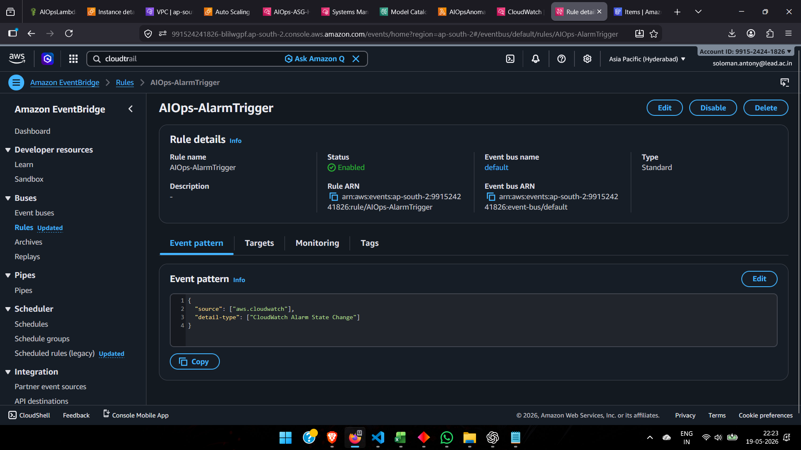
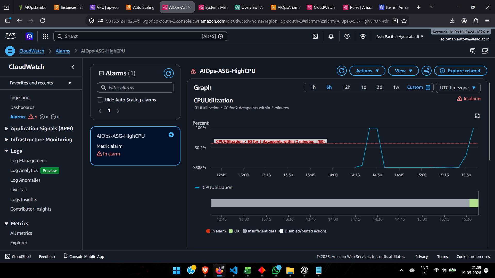
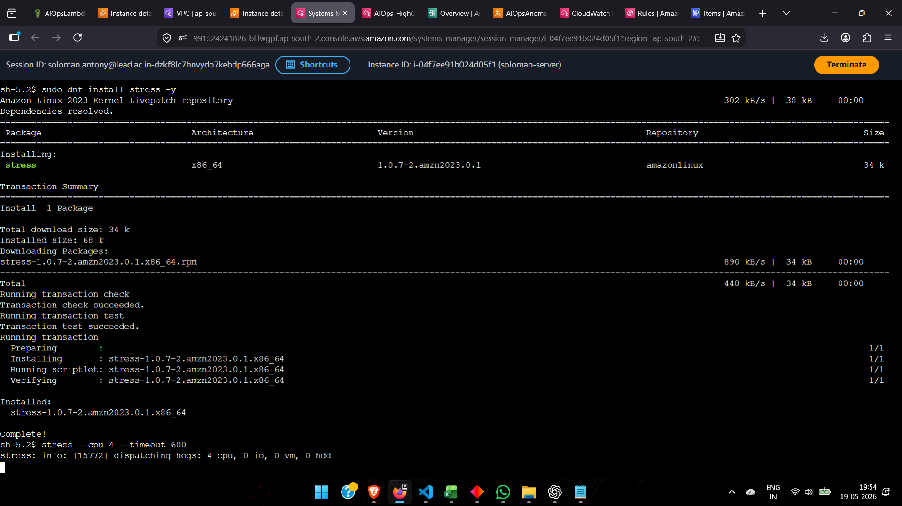
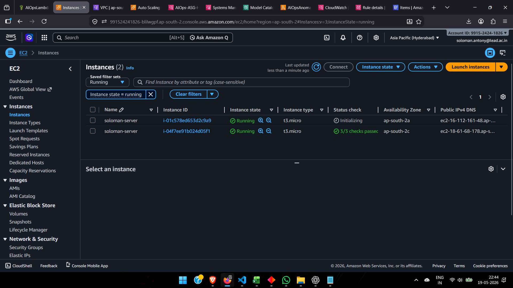
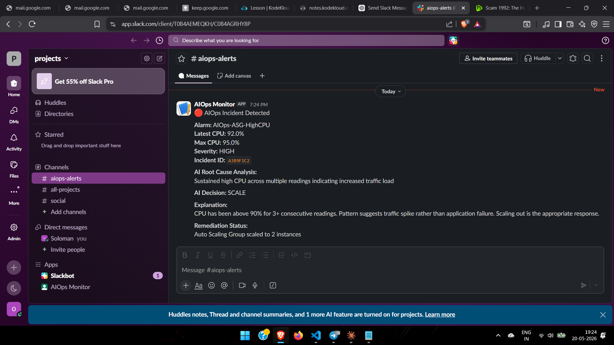
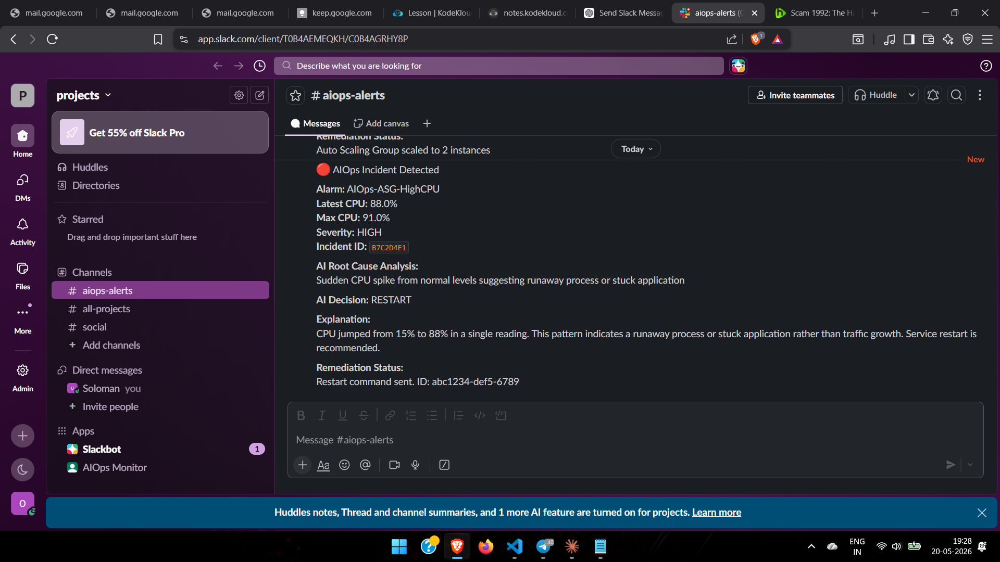
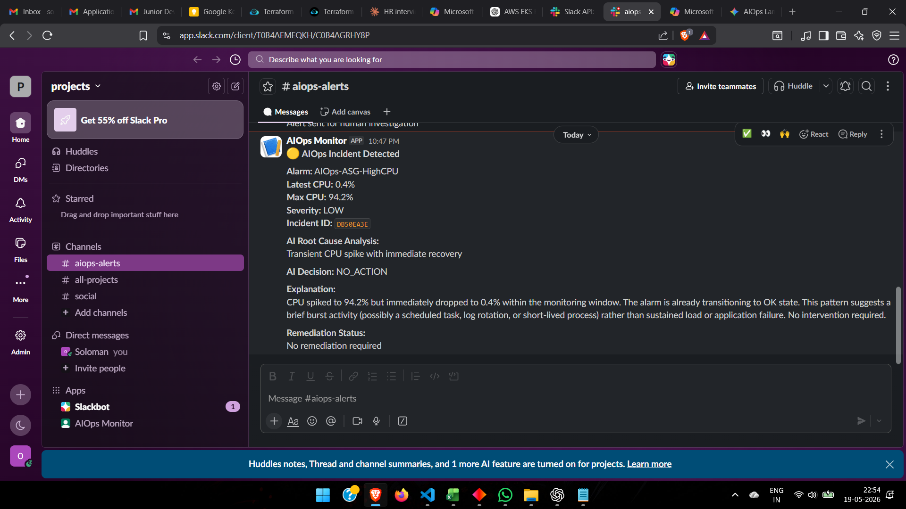
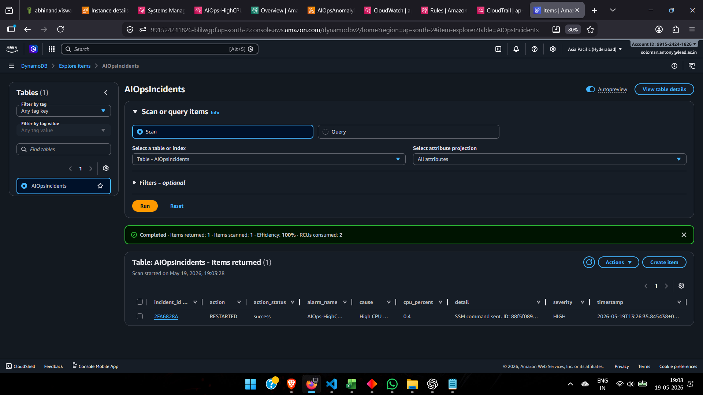

# AI-Powered AIOps Remediation System on AWS

An AI-driven AIOps platform built using AWS services that automatically detects infrastructure anomalies, performs AI-based root cause analysis (RCA), and intelligently selects remediation actions such as scaling, restart, alerting, or no action.

---

# Architecture

```text
CloudWatch Alarm
        ↓
EventBridge
        ↓
AWS Lambda
        ↓
Amazon Bedrock (Claude AI)
        ↓
Intelligent Decision Engine
   ├── SCALE (ASG)
   ├── RESTART (SSM)
   ├── ALERT_ONLY
   └── NO_ACTION
        ↓
DynamoDB Incident Logging
        ↓
Slack Notifications
```

---

# Features

- AI-powered root cause analysis using Claude AI
- Automated remediation decision engine
- Dynamic scaling using Auto Scaling Groups (ASG)
- Automated restart remediation using AWS Systems Manager (SSM)
- Real-time Slack notifications
- Incident logging using DynamoDB
- Event-driven architecture using EventBridge
- Cloud-native serverless implementation

---

# AWS Services Used

| Service | Purpose |
|---|---|
| AWS Lambda | Core remediation engine |
| CloudWatch | Monitoring and alarms |
| EventBridge | Event routing |
| Amazon Bedrock | AI reasoning and RCA |
| DynamoDB | Incident logging |
| EC2 Auto Scaling | Horizontal scaling |
| Systems Manager (SSM) | Automated restart actions |
| Slack Webhooks | Notifications |
| Application Load Balancer | Traffic distribution |

---

# AI Decision Logic

The AI engine analyzes:
- CPU usage patterns
- Sustained vs transient spikes
- Infrastructure load behavior
- Application instability patterns

Then selects one action:

| Action | Purpose |
|---|---|
| SCALE | Scale ASG during sustained load |
| RESTART | Restart unhealthy services |
| ALERT_ONLY | Notify human operator |
| NO_ACTION | Ignore transient spikes |

---

# Project Workflow

1. CloudWatch detects high CPU utilization
2. EventBridge triggers Lambda
3. Lambda collects metrics and telemetry
4. Claude AI performs RCA
5. AI selects remediation action
6. Lambda executes remediation
7. Incident stored in DynamoDB
8. Slack alert sent

---

# Test Scenarios

## SCALE Scenario

Simulated sustained infrastructure load using:

```bash
stress --cpu 4 --timeout 600
```

Expected behavior:
- AI selects SCALE
- ASG scales from 1 → 2 instances
- Slack alert generated

---

## RESTART Scenario

Simulated unhealthy service behavior using:

```bash
sudo systemctl stop httpd
```

Expected behavior:
- AI selects RESTART
- SSM executes restart command
- Slack alert generated

---

## ALERT_ONLY Scenario

Simulated moderate anomaly with insufficient evidence.

Expected behavior:
- AI selects ALERT_ONLY
- Human investigation recommended

---

## NO_ACTION Scenario

Simulated short-lived CPU burst.

Expected behavior:
- AI selects NO_ACTION
- No remediation triggered

---

# Screenshots

## Lambda Function



---

## EventBridge Rule



---

## CloudWatch Alarm Trigger



---

## Stress Test



---

## ASG Scaled to Two Instances



---

## Slack Alert — SCALE



---

## Slack Alert — RESTART



---

## Slack Alert — NO ACTION



---

## DynamoDB Incident Record



---

# Example Slack Output

```text
:red_circle: AIOps Incident Detected

Alarm: AIOps-ASG-HighCPU
Latest CPU: 100.0%
Max CPU: 100.0%
Severity: CRITICAL

AI Decision: SCALE

Explanation:
Sustained CPU saturation detected. Horizontal scaling selected to distribute infrastructure load.

Remediation Status:
ASG scaled successfully from 1 → 2 instances.
```

---

# Security & IAM

The project uses least-privilege IAM roles for:
- Lambda execution
- Bedrock model access
- SSM command execution
- DynamoDB write access
- CloudWatch metric access
- Auto Scaling control

---

# Future Improvements

- Per-instance intelligent remediation
- Memory and disk anomaly detection
- Predictive scaling using ML
- Grafana dashboards
- Multi-region failover
- Kubernetes/EKS integration
- AI anomaly trend analysis

---

# Author

Soloman Antony

Cloud / DevOps / AIOps Engineering Project